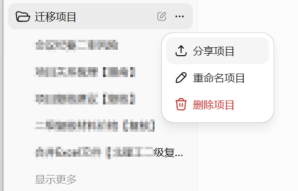
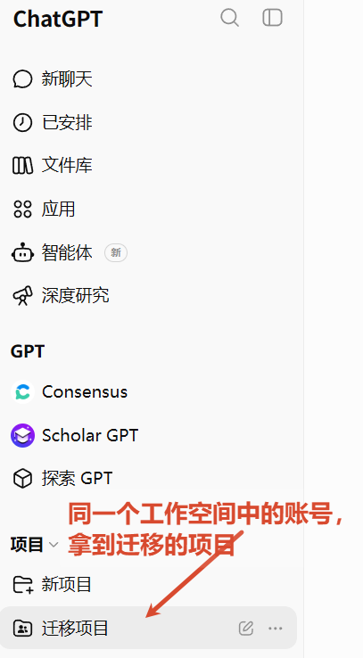
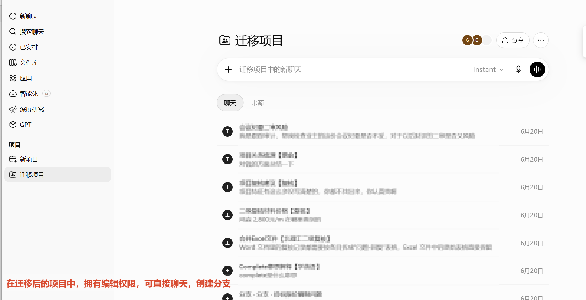
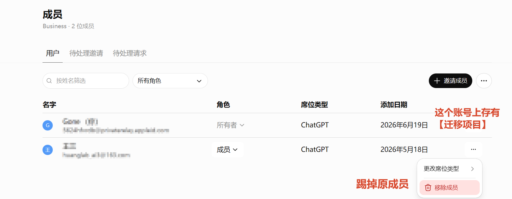
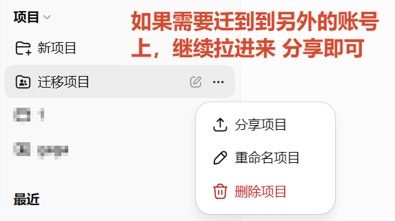

# 不同GPT账号间聊天记录转移，可生成1对1聊天框【支持工作空间】

## 一、面对的问题

当我们在同一个 ChatGPT / Codex 工作空间中使用多个账号时，可能会遇到需要在不同账号之间迁移聊天记录的情况。

一个典型场景是：**账号 A 因为二验、登录、手机号或其他账号问题，无法继续正常使用 Codex**；**这时新建了账号 B，但账号 A 里已有很多重要聊天记录、项目上下文和工作空间内容，不想全部丢掉。**

本文主要记录一种可行方案：将账号 A 中的聊天记录转移到账号 B，并让账号 B 继续使用这些聊天记录和 Codex。如果账号 B 具备手机号等必要条件，也可以继续完成 Codex 相关操作。

适用范围：

- 适用于买一送一的 Business 用户。
- 应该也适用于 Plus、Pro 等支持项目和工作空间协作的用户。
- 适用于需要在账号 A、账号 B、账号 C 之间继续流转聊天记录的情况。

核心前提：

- **聊天记录需要先放入同一个项目中**。
- Business 工作空间的项目共享**要求用户同处于同一个工作空间**。
- 因此账号 A 和账号 B 必须先处于同一个工作空间中，才能通过项目共享迁移聊天记录。

## 二、解决步骤

下面以“买一送一”的 Business 用户为例，说明如何把账号 A 的聊天记录转移到账号 B。

### 步骤 1：账号 A 整理迁移项目

首先，在账号 A 中新建或选择一个用于迁移的项目，例如“迁移项目”。

然后把账号 A 中需要转移的聊天记录全部移动到这个迁移项目下面。整理完成后，在项目菜单中点击“分享项目”。

### 步骤 2：把迁移项目分享给账号 B

在分享项目时，搜索账号 B，并把项目分享给账号 B。

注意：这里需要给账号 B “可以编辑”的权限。只有具备编辑权限，账号 B 才能在迁移后的项目中直接聊天、创建分支，并继续使用原有聊天记录。

分享完成后，切换到账号 B 所在的同一个工作空间，就可以在项目列表中看到这个“迁移项目”。

进入项目后，账号 B 可以看到迁移过来的聊天记录。如果拥有编辑权限，就可以继续聊天、继续使用项目上下文，也可以基于原聊天创建分支。

### 步骤 3：继续分享给其他账号

如果后续还需要把这些聊天记录迁移到账号 C，可以先在工作空间成员管理中处理账号权限。

一种做法是：把当前已经不再需要的账号 A 移出工作空间，然后再邀请新的账号 C 进入同一个工作空间。

账号 C 加入后，再通过账号 B 继续分享“迁移项目”给账号 C。这样聊天记录就可以继续向新的账号流转。

## 三、注意事项与总结

### 注意事项

1. 账号必须在同一个工作空间中。

2. 分享时要给“可编辑”权限。

3. 迁移前先整理聊天记录。

4. 移除账号A后，分享项目可以留存在账号B中
5. **拿到迁移后的账号，跟它对话即可得到分支，移动到其他项目中**

